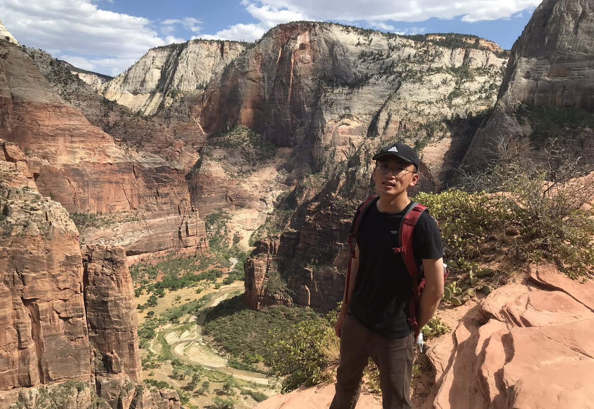
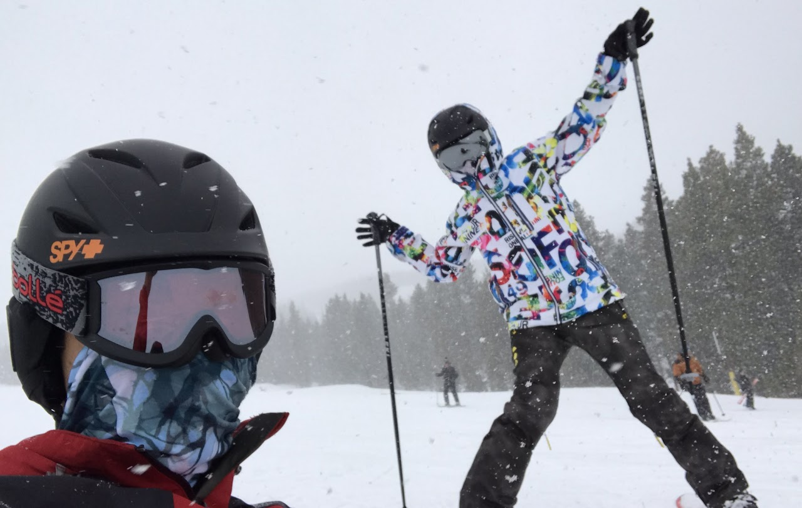

## About me
 
Hello! I'm a research scientist with a passion for understanding the plasma side of the universe, from the largest cosmic structures to our own Sun.

My journey began in Chiayi, my hometown in southern Taiwan. I pursued both my bachelor's and master's degrees at National Tsing Hua University, where I first dove into theoretical physics by studying modified gravity.

In 2014, I moved to California for my Ph.D. at the University of California San Diego. There, my research shifted to the dark side of the universe, focusing on dark matter and neutrino physics under the supervision of Prof. George Fuller and Prof. Tongyan Lin. After graduating in 2021, I moved to Midwest to become a postdoctoral fellow at the Center for Cosmology and AstroParticle Physics (CCAPP) at The Ohio State University.

I am currently a Research Scientist at CCAPP. My work has taken me on a journey across different scales of the universe. I am currently excited to be tackling challenges in solar and plasma physics.

  
Outside physics, I enjoy surfing, snowboarding, climbing, hiking and running marathons.
   
   

