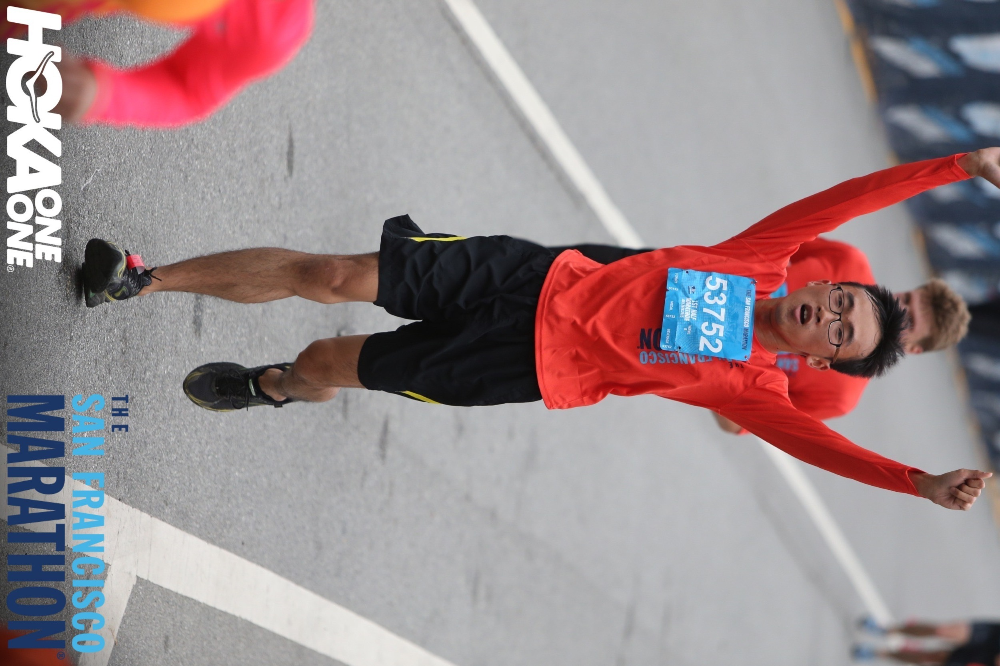

## About me
 
Hello! I'm a physicist fascinated by the plasma universe, from the intricate dynamics of our Sun to the vast environments of its largest structures.
  
My journey began in Chiayi, my hometown in southern Taiwan. I pursued both my bachelor's and master's degrees at National Tsing Hua University, where I first delved into theoretical physics through studies of modified gravity and post-Newtonian expansion.
  
In 2014, I began my doctoral studies at the University of California San Diego. Under the guidance of Prof. George Fuller and Prof. Tongyan Lin, my research explored the "dark side" of the universe through studies of dark matter and neutrino physics.
  
After graduating in 2021, my path led me to The Ohio State University's Center for Cosmology and AstroParticle Physics (CCAPP). I started as a CCAPP postdoctoral fellow before transitioning to my current role as a Research Scientist. Here, my work focuses on the exciting challenges of solar and plasma physics, with a specialization in solar gamma rays and cosmic-ray transport.
  
Outside of research, I enjoy surfing, snowboarding, climbing, hiking and running marathons.
  
 
 
 
(Below: with American professional rock climber Brooke Raboutou) 
 

