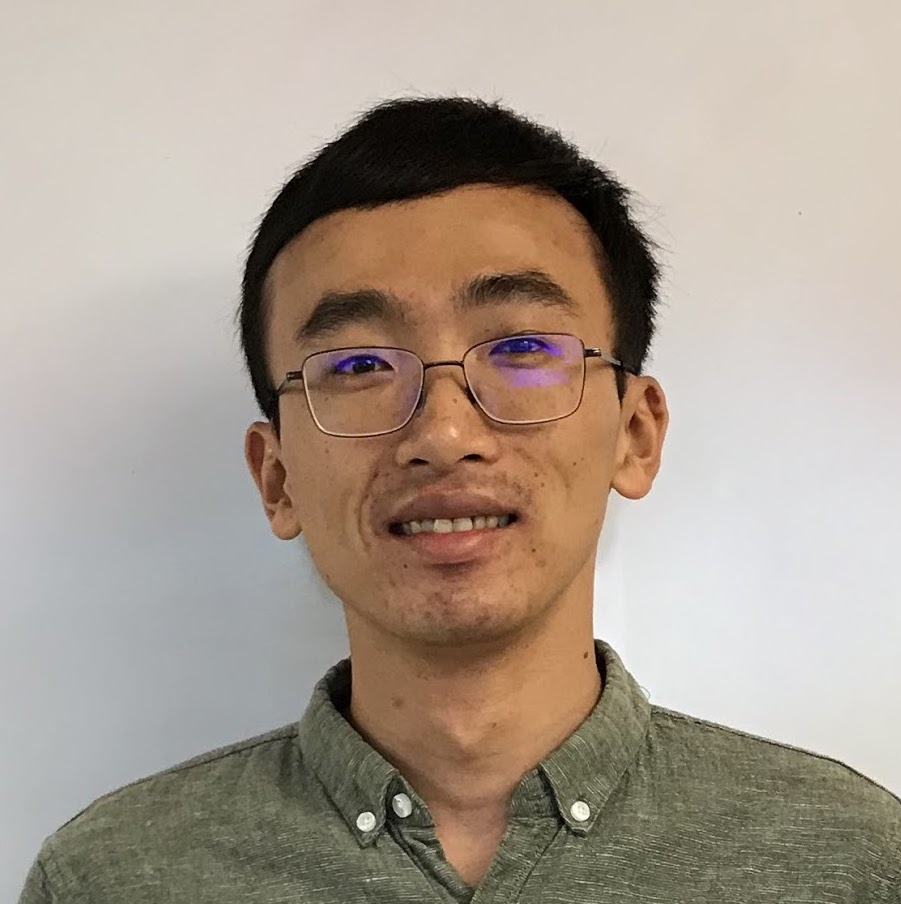

Hi! I am a postdoctoral researcher at the Center for Cosmology and AstroParticle Physics in The Ohio State University. My research interests are particle and plasma astrophysics, dark matter and the early cosmos.

