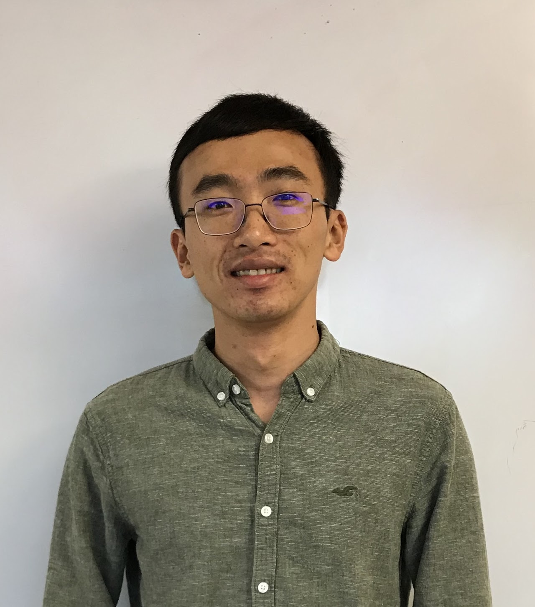

Hi! I am a postdoctoral researcher at the Center for Cosmology and AstroParticle Physics at The Ohio State University. 
  
My research interests are high energy astrophysics, plasma physics, and dark matter. The focus of my current research is solar gamma rays and vortex knot disruption.
  

