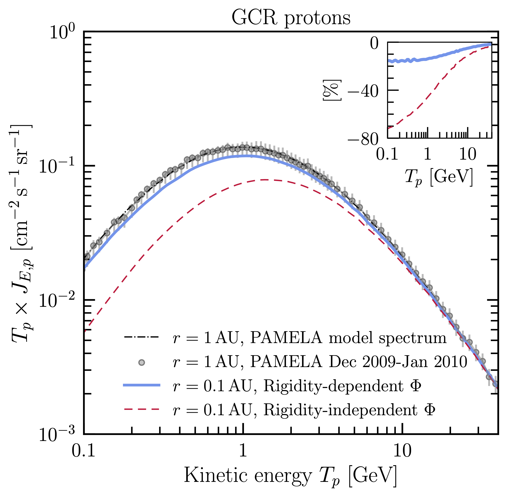
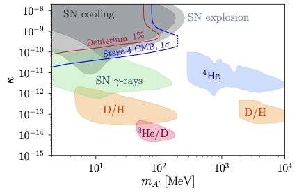
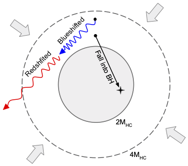

## Research
 

### I. Solar-disk gamma-ray emission:

  
The solar disk is a continuous source of GeV--TeV gamma rays. The emission is thought to originate from hadronic Galactic cosmic rays (GCRs) interacting with the gas in the photosphere and uppermost convection zone after being reflected by solar magnetic fields. Despite this general understanding, existing theoretical models have yet to match observational data. At the photosphere and the uppermost convection zone, granular convection drives a multi-scale magnetic field, forming a larger-scale filamentary structure while also generating turbulence-scale Alfvén wave turbulence. Here, we demonstrate that the larger-scale filamentary field shapes the overall gamma-ray emission spectrum, and the Alfvén wave turbulence is critical for further suppressing the gamma-ray emission spectrum below 100 GeV. For a standard Alfvén wave turbulence level, our model's predicted spectrum slope from 1 GeV to 1 TeV is in excellent agreement with observations from Fermi-LAT and HAWC, an important achievement. The predicted absolute flux is a factor of 2 to 5 lower than the observed data; we outline future directions to resolve this discrepancy. The key contribution of our work is providing a new theoretical framework for using solar disk gamma-ray observations to probe hadronic GCR transport in the lower solar atmosphere.  
[1] **J.-T. Li**, M. Asgari-Targhi, J. F. Beacom, and A. H. G. Peter, <a href="https://arxiv.org/abs/2508.14154">arXiv: 2508.14154 (2025)</a> 
[2] J.-T. Li, J. F. Beacom, S. Griffith, and A. H. G. Peter, <a href="https://doi.org/10.3847/1538-4357/ad158f">ApJ 961, 167 (2024)</a> 
[3] S. Griffith, J. F. Beacom, J.-T. Li and A. H. G. Peter, <a href="https://doi.org/10.1103/yyvx-tnjl">Phys. Rev. D 112, 043009 (2025)</a> 
[4] T. Linden, J.-T. Li, B. Zhou, I. John, M. Crnogorčević, A. H. G. Peter, and J. F. Beacom, <a href="https://arxiv.org/abs/2505.04625">arXiv: 2505.04625 (2025)</a>
   

### II. Cosmic-ray transport in the inner heliosphere:

  
A key goal of heliophysics is to understand how cosmic rays propagate in the solar system's complex, dynamic environment. One observable is solar modulation, i.e., how the flux and spectrum of cosmic rays changes as they propagate inward.
  
We construct an improved force-field model, taking advantage of new measurements of magnetic power spectral density by Parker Solar Probe to predict solar modulation within the Earth's orbit. We find that modulation of cosmic rays between the Earth and Sun is modest, at least at solar minimum and in the ecliptic plane. Our results agree much better with the limited data on cosmic-ray radial gradients within Earth's orbit than past treatments of the force-field model. Our predictions can be tested with forthcoming direct cosmic-ray measurements in the inner heliosphere by Parker Solar Probe and Solar Orbiter. They are also important for interpreting the gamma-ray emission from the Sun due to scattering of cosmic rays with solar matter and photons.
  
[1] J.-T. Li, J. F. Beacom, and A. H. G. Peter, <a href="https://doi.org/10.3847/1538-4357/ac8cf3">ApJ 937, 27 (2022)</a>
   

### III. Dark photons & big bang bucleosynthesis:
 

  
Freeze-in dark photons decaying out of equilibrium during the weak-decoupling epoch results in an entropy flow between the neutrino and plasma sectors. In my work with G. M. Fuller and E. Groh[1], we trace the evolution of nucleosynthesis numerically from the beginning of weak decoupling with the presence of late-decay dark photons. Using the 1%-level primordial deuterium abundance measurements from quasar absorption lines, our result excludes a range of dark photon model parameters.
  
[1] J.-T. Li, G. M. Fuller, and E. Grohs, <a href="https://doi.org/10.1088/1475-7516/2020/12/049">JCAP 12 (2020) 049</a>
   

### IV. Dark matter & plasma instability:

  
Milli-charged dark matter (mDM) possesses fractional electric charge and allows DM to have electromagnetic interaction with baryons. In my work with T. Lin[2], we provide a mechanism for a collisionless mDM to scatter efficiently with Standard Model particles. Our work reveals that the supernova shocks could sweep up and thermalize the ambient mDM via plasma instability. However, these mDM particles return to having roughly the ambient DM velocity in the end due to the adiabatic decompression. Our result implies the detectability of terrestrial experiments to mDM is not strongly affected by supernova shocks.
  
[1] J.-T. Li and T. Lin, <a href="https://doi.org/10.1103/PhysRevD.101.103034">Phys. Rev. D 101, 103034 (2020)</a>
   

### V. Gravitational waves & supermassive stars:

  
Supermassive stars collapse under post-Newtonian instability and become black holes. During the collapses, they radiate a significant fraction of their rest mass in neutrinos. In my work with G. M. Fuller and C. T. Kishimoto[3], we investigate the gravitational wave signatures driven by the neutrino bursts, which create nearly unique “memory” gravitational waves that fall in the optimal frequency band of DECIGO and BBO. We show this route of supermassive black hole formation is potentially detectable to redshifts as high as 13, before the epoch of reionization.
  
[1] J.-T. Li, G. M. Fuller, and C. T. Kishimoto, <a href="https://doi.org/10.1103/PhysRevD.98.023002">Phys. Rev. D 98, 023002 (2018)</a>
